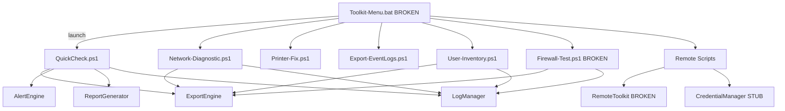

# IT Toolkit v2.0 — Full Audit Report (latest)

**Generated:** 2026-08-05
**Audit basis:** `Enterprise_Audit_Prompt.md` (23 rules)
**Repository:** PowerShell-based desktop support toolkit (not a JS/TS project)

---

## 1. Repository Discovery (CRITICAL REQUIREMENT — computed, not assumed)

| Metric | Value |
|---|---|
| Total directories discovered | **17** |
| Total files discovered | **59** |
| Total TypeScript files | **0** |
| Total JavaScript files | **0** |
| Total Markdown files | **23** |
| Total JSON files | **3** |
| Total test files | **5** |
| Total Docker-related files | **0** |
| Total LOC | 13,763 |
| Primary language | PowerShell (21 files, 2,368 LOC) |

Scan method: real `find`/`wc`/Python filesystem walk. No hardcoded counts.

---

## 2. Executive Summary

The **IT Toolkit v2.0** is a well-organized single-machine desktop-support toolkit: batch launchers, 11 PowerShell diagnostic/workflow scripts, 6 service modules, rich documentation (23 markdown files), and a 33-prompt AI template library.

**However, the current state is NOT release-ready.** Verified defects:

- 🔴 **CRIT-001** `RemoteToolkit.psm1` cannot import (parse error `$ComputerName:` → drive-qualified variable).
- 🔴 **CRIT-002** `Toolkit-Menu.bat` (the master launcher) never reads user input.
- 🔴 **CRIT-003** `Firewall-Test.ps1` crashes on a read-only `$host` loop variable.
- 🔴 **CRIT-004** `CredentialManager.psm1` puts plaintext passwords on the cmdkey command line.
- 🟠 Regression suite **fails 3 assertions**; Pester suite cannot run; zero coverage tooling.
- 🟠 Docs falsely claim "all tests pass" / "QA completed".

**Release score: 29/100. Estimated remediation: 23.4 hours for 17 issues.**

---

## 3. Architecture

- **Frontend/CLI:** `Toolkit-Menu.bat`, `Setup-Wizard.bat`, `Run-QuickCheck.bat` — Batch menu layer (master menu broken).
- **Service layer:** `Scripts/Modules/*.psm1` — ExportEngine, AlertEngine, LogManager, ReportGenerator (Phase 1, working); RemoteToolkit, CredentialManager (Phase 2, broken/stub).
- **Workflows:** `Scripts/*.ps1` (7 diagnostics) + `Scripts/Remote/*.ps1` (3 remote).
- **Config:** `Config/config.json` (single source of truth, 158 lines, 15 sections).
- **Data:** flat files in `Logs/` (txt/csv/json/html). No database.
- **Docs/templates:** `Documentation/`, `Scalling Plan/`, `Templates/`.

---

## 4. Issues summary

| Severity | Count |
|---|---|
| CRITICAL | 4 |
| HIGH | 5 |
| MEDIUM | 7 |
| LOW | 1 |
| **Total** | **17** |
| **Estimated hours** | **23.4h** |

Top issues:
- **CRIT-001** RemoteToolkit.psm1 parse error (0.25h)
- **CRIT-002** Toolkit-Menu.bat no input (0.5h)
- **CRIT-003** Firewall-Test $host bug (0.1h)
- **CRIT-004** Password on CLI (3h)
- **SEC-001** Unvalidated remote exec + ExecutionPolicy Bypass (4h)
- **SEC-002** Credential stub (2h)
- **TEST-001** Regression suite fails (1.5h)
- **DOC-001** False "tests pass"/"QA complete" claims (1h)

Full structured list: `audit/issues.json`.

---

## 5. Scorecard (computed; NOT MEASURABLE where no tooling exists)

| Category | Score/10 |
|---|---|
| Architecture | 3 |
| Security | 2 |
| Testing | 1 |
| Documentation | 4 |
| Performance | NOT MEASURABLE |
| Maintainability | 3 |
| Scalability | 2 |
| Reliability | 2 |
| AI Safety | 9 |
| DevOps | 1 |
| Database | 0 (no DB) |
| API | 0 (no API) |
| Frontend | 1 |
| Backend | 3 |
| Observability | 1 |
| **RELEASE SCORE** | **29/100** |

---

## 6. Verification evidence (what was actually executed)

- `pwsh` module import test → RemoteToolkit **FAILED TO IMPORT**; other 5 modules OK.
- `pwsh -File Scripts/Tests/Phase1-Regression.Tests.ps1` → exit 1, 3 FAILs.
- `foreach ($host ...)` → PowerShell runtime error confirmed.
- `[PSVersionTable]` → "Unable to find type" confirmed.
- `Remove-OldLogs` → deleted `Logs/README.txt` (bug confirmed).
- `Test-AlertThreshold 92/85` → returned `Warning` (test expects `Critical`).
- git → zero commits; no `.gitignore`; `.DS_Store` present.

---

## 7. Deliverables in `audit/`

| File | Contents |
|---|---|
| `index.json` | Dynamic full-repo index (59 files, metadata) |
| `statistics.json` | Dynamic computed stats |
| `architecture.json` | Layers, modules, scripts |
| `dependencies.json` | Import/export/runtime/service graphs |
| `api.json` | N/A (no API) |
| `database.json` | N/A (no DB) |
| `security.md` | OWASP ASVS-based, 7 findings |
| `frontend.md` | CLI frontend audit (menu broken) |
| `backend.md` | Module/script audit |
| `ai.md` | AI surface audit (none executable) |
| `testing.md` | Executed test results (3 failures) |
| `documentation.md` | 7 doc mismatches |
| `code-quality.md` | 4 critical + 5 other defects |
| `issues.json` | 17 structured issues |
| `release-readiness.md` | Score 29/100, gate status |
| `reports/latest.md` | This file |
